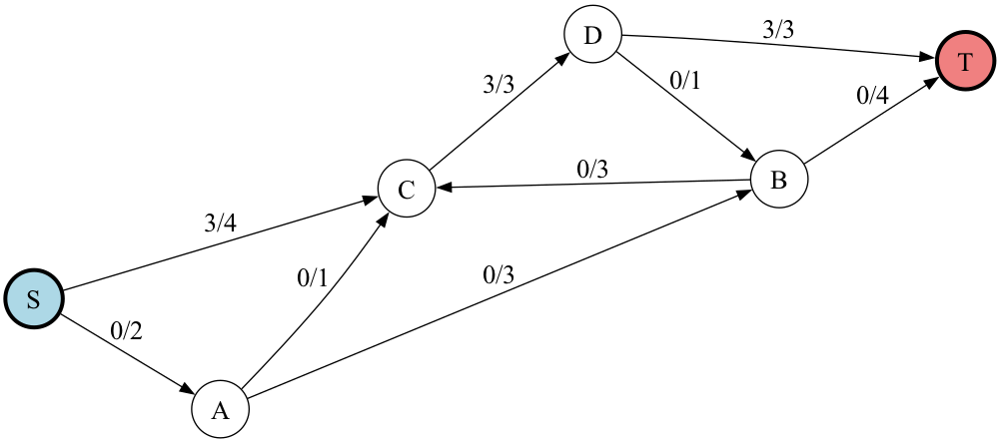
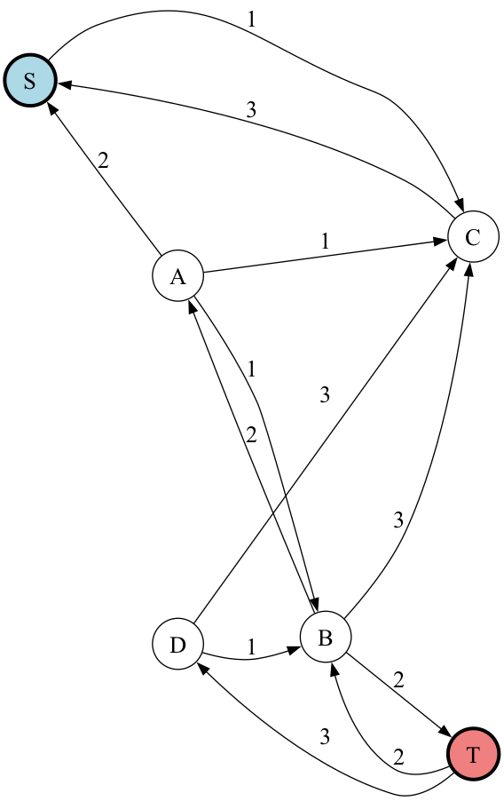
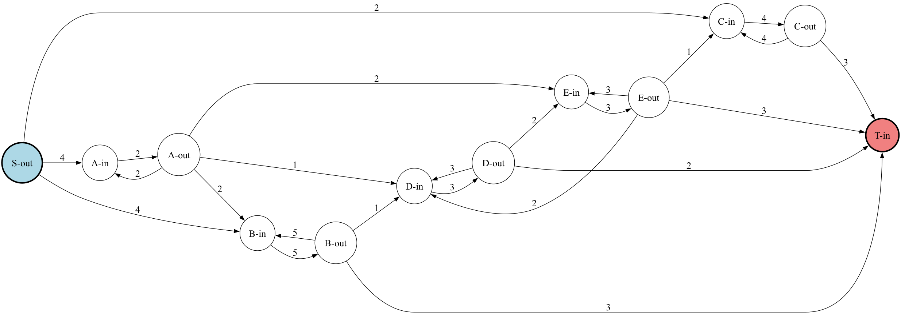
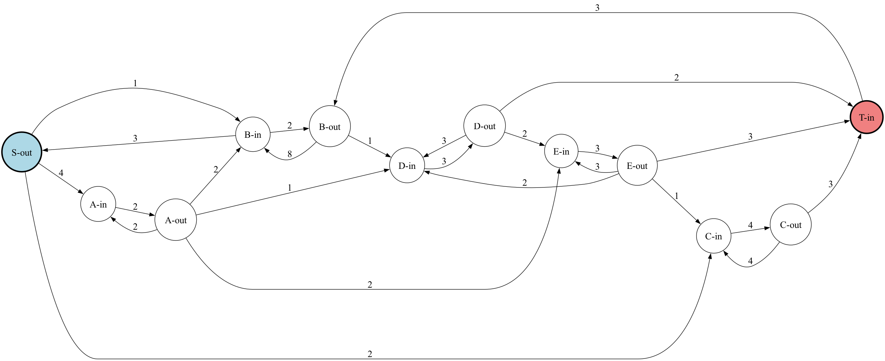
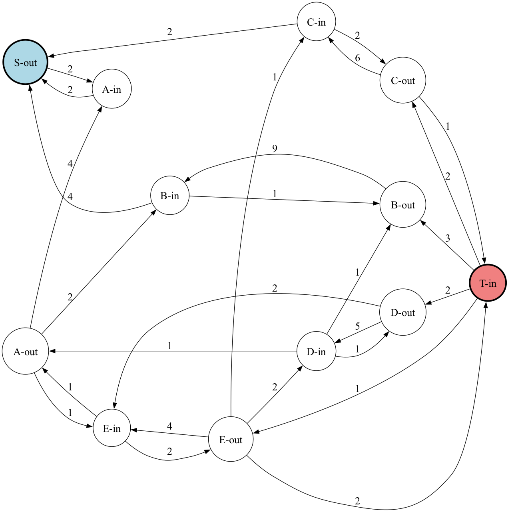
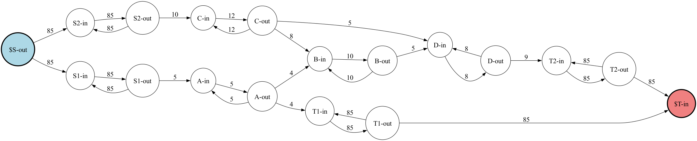
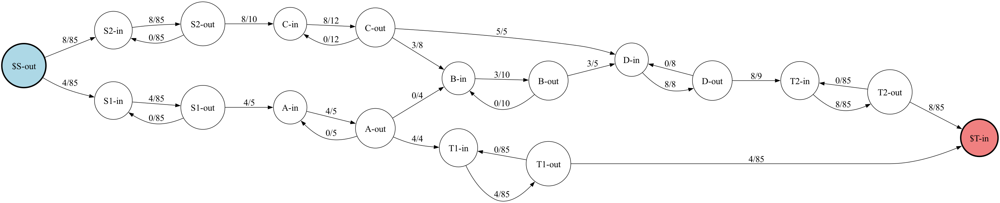

# Flow Capacitated Networks

Determine the max flow through various types of capacitated networks.

The library supports operations on edge and vertex capacitated networks with any amount of sources and terminals.
The ```FlowCapacitatedNetwork``` class automatically generates and manages residual graphs, performs path augmentation and iterative flow maximization, finds min cuts, and exports capacity, flow, and residual graphs as DOT or image files.

## Examples

### Edge Capacitated Network

```cpp
FlowCapacitatedNetwork::fromEdgeCapacitated(
    { "S", "A", "B", "C", "D", "T" },
    "S",
    "T",
    {
        Edge("S", "A", 2),
        Edge("S", "C", 4),
        Edge("A", "B", 3),
        Edge("A", "C", 1),
        Edge("B", "C", 3),
        Edge("B", "T", 4),
        Edge("C", "D", 3),
        Edge("D", "B", 1),
        Edge("D", "T", 3)
    }
)
```

Capacity Graph


<br />

Flow Graph After 1 Augmentation



<br />

Residual Graph After 1 Augmentation


<br />

Optimal Flow Graph


<br />

Optimal Residual Graph



<br />

### Edge and Vertex Capacitated Network

```cpp
FlowCapacitatedNetwork::fromEdgeAndVertexCapacitated(
    { "S", "A", "B", "C", "D", "E", "T" },
    "S",
    "T",
    {
        Edge("S", "A", 4),
        Edge("S", "B", 4),
        Edge("S", "C", 2),
        Edge("A", "B", 2),
        Edge("A", "D", 1),
        Edge("A", "E", 2),
        Edge("B", "D", 1),
        Edge("B", "T", 3),
        Edge("C", "T", 3),
        Edge("D", "E", 2),
        Edge("D", "T", 2),
        Edge("E", "C", 1),
        Edge("E", "D", 2),
        Edge("E", "T", 3)
    },
    {
        { "A", 2 },
        { "B", 5 },
        { "C", 4 },
        { "D", 3 },
        { "E", 3 },
    }
)
```

Capacity Graph



<br />

Flow Graph After 1 Augmentation


<br />

Residual Graph After 1 Augmentation



<br />

Optimal Flow Graph


<br />

Optimal Residual Graph



<br />

### Multi Boundary Edge and Vertex Capacitated Network

```cpp
FlowCapacitatedNetwork::fromMultiBoundaryEdgeAndVertexCapacitated(
    { "S1", "S2", "A", "B", "C", "D", "T1", "T2" },
    { "S1", "S2" },
    { "T1", "T2" },
    {
        Edge("S1", "A", 5),
        Edge("S2", "C", 10),
        Edge("A", "B", 4),
        Edge("A", "T1", 4),
        Edge("B", "D", 5),
        Edge("C", "B", 8),
        Edge("C", "D", 5),
        Edge("D", "T2", 9),
    },
    {
        { "A", 5 },
        { "B", 10 },
        { "C", 12 },
        { "D", 8 }
    }
)
```

Capacity Graph



<br />

Flow Graph After 1 Augmentation


<br />

Residual Graph After 1 Augmentation


<br />

Optimal Flow Graph



<br />

Optimal Residual Graph


